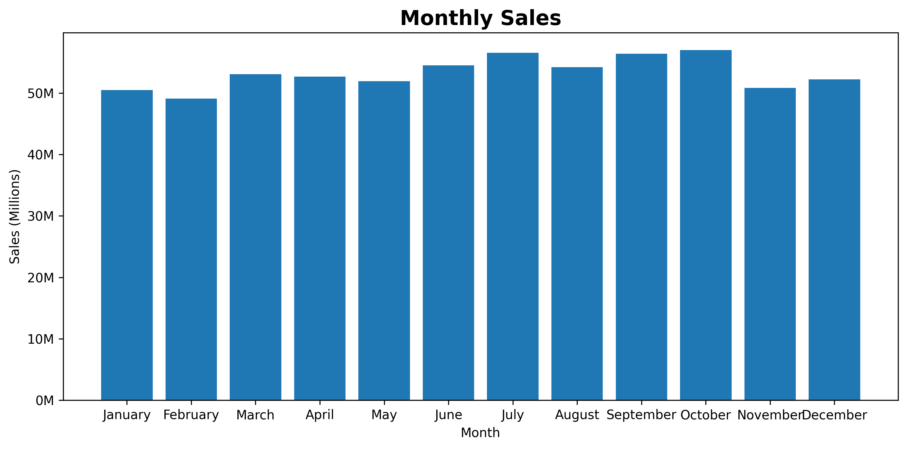
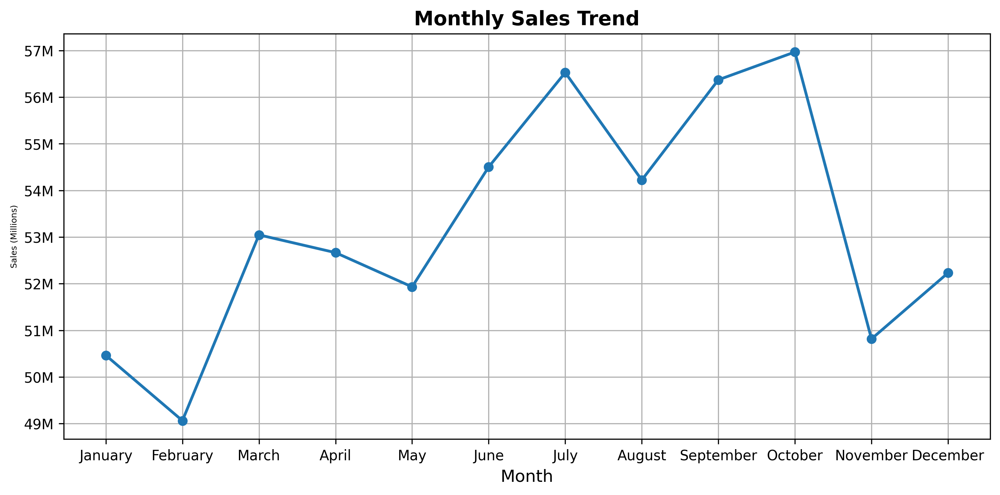
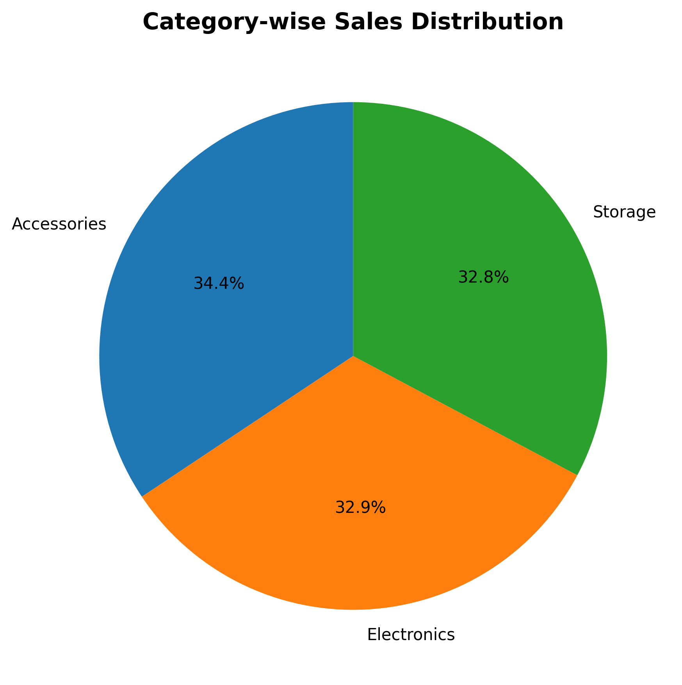
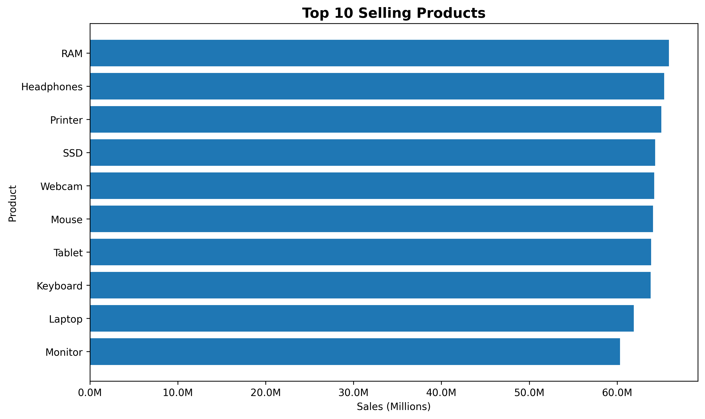
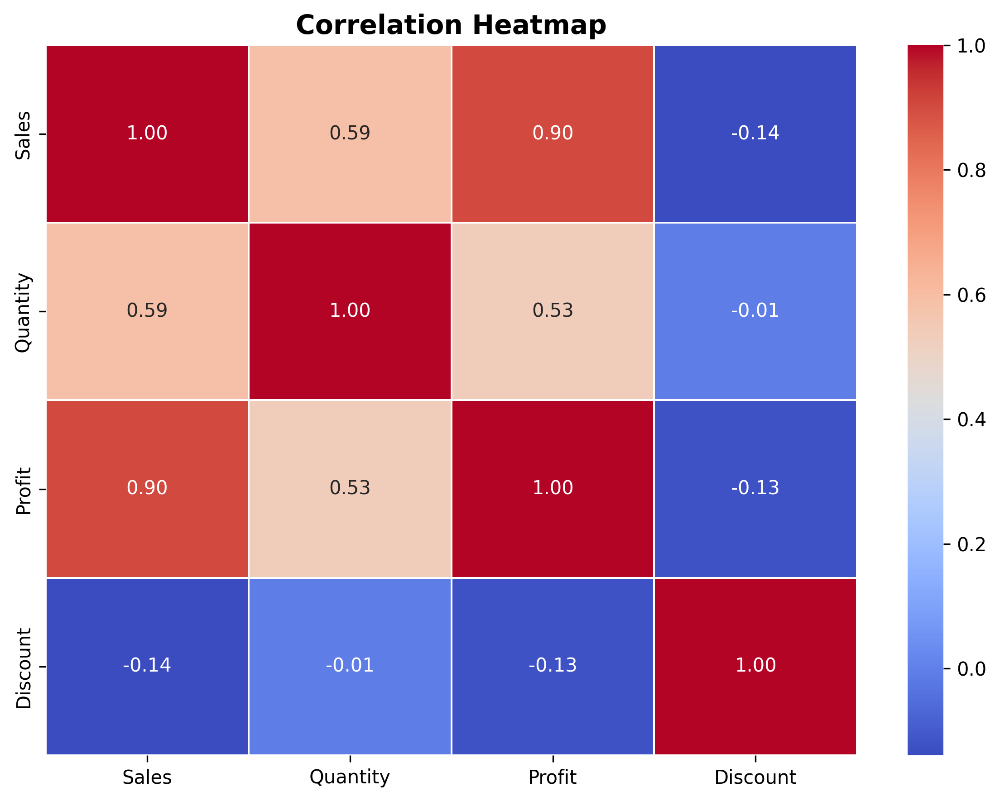

# 📊 Sales Data Analysis using Python

## 📌 Project Overview

This project analyzes sales data using Python. It performs data cleaning, exploratory data analysis (EDA), and creates visualizations to identify business insights.

---

## 🛠 Technologies Used

- Python
- Pandas
- Matplotlib
- Seaborn

---

## 📂 Project Structure

```
Python-Sales-Data-Analysis/
│
├── data/
│   └── sales_data.csv
│
├── output/
│   ├── monthly_sales_bar.png
│   ├── monthly_sales_line.png
│   ├── category_sales_pie.png
│   ├── top10_products.png
│   └── correlation_heatmap.png
│
├── src/
│   └── analysis.py
│
├── requirements.txt
└── README.md
```

---

## 📈 Analysis Performed

- Dataset Overview
- Missing Value Analysis
- Duplicate Record Analysis
- Total Sales
- Total Profit
- Average Sales
- Average Profit
- Product-wise Sales
- Region-wise Sales
- Category-wise Profit
- Monthly Sales Analysis

---

## 📊 Visualizations

- Monthly Sales Bar Chart
- Monthly Sales Trend Line Chart
- Category-wise Sales Pie Chart
- Top 10 Selling Products
- Correlation Heatmap

---

## 💡 Business Insights

- Identified highest sales region
- Identified highest profit category
- Identified best-selling product
- Identified highest sales month

---

## ▶️ Run the Project

```bash
pip install -r requirements.txt
python3 src/analysis.py
```

---

## 📷 Output

Charts are saved inside the **output/** folder.

## Monthly Sales



## Monthly Sales Trend



## Category Sales



## Top Products



## Correlation Heatmap

